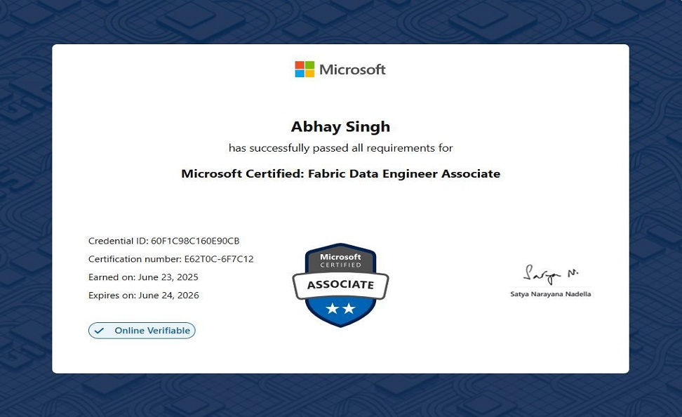
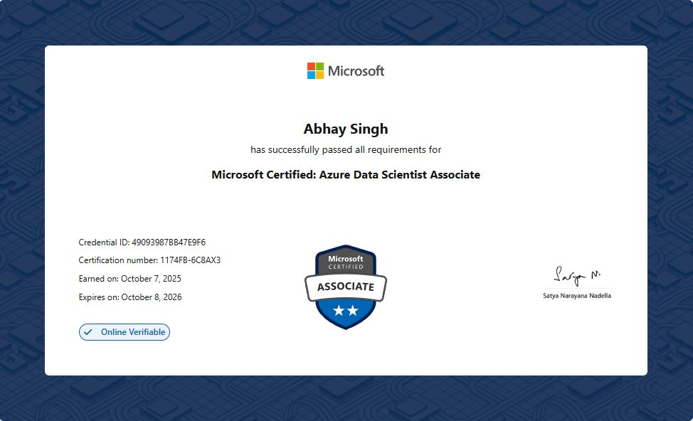
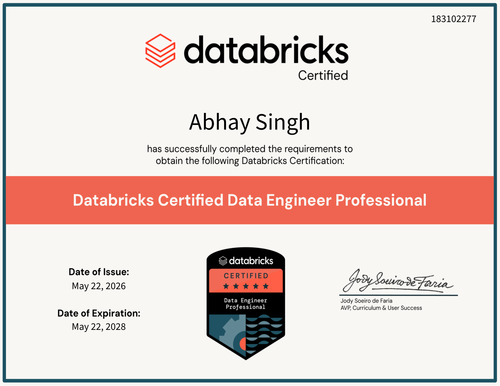
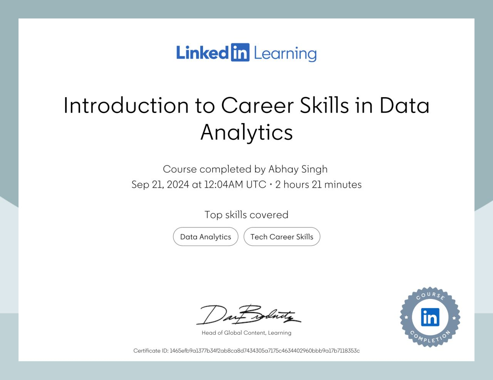

# 👋 Hello, I'm Abhay Singh

### 🚀 Data Engineer | MS Data Science Graduate | AI & Cloud Data Enthusiast

<p>
  <a href="mailto:abhaysingh89@hotmail.com">
    
  </a>
  <a href="https://www.linkedin.com/in/abhay-data-ai">
    
  </a>
  <a href="https://github.com/abhaycodesdata">
    
  </a>
</p>

📍 **Stockholm, Sweden**

---

## 🌐 About Me

I am a **Data Engineering professional with 10+ years of experience** in building ETL/ELT pipelines, data platforms, reporting solutions, and analytics-ready datasets across **SSIS, SQL Server, Azure, Databricks, PySpark, SQL, and Power BI**.

I have completed my **Master’s in Data Science from Stockholm University**, strengthening my knowledge in **Machine Learning, Deep Learning, Applied Mathematics, Statistical Modeling, Time-Series Forecasting, and AI-driven analytics**.

My strength is combining practical enterprise data engineering experience with modern cloud, analytics, and AI knowledge. I enjoy building clean, scalable, and trusted data solutions that help businesses move from raw data to reporting, insights, and AI-ready platforms.

---

## 🌟 Professional Highlights

| Area | Highlights |
|---|---|
| 🎓 Education | **MS Data Science** - Stockholm University, Sweden |
| 🎓 Degree | **B.Tech Computer Science** - UPTU, India *(2008 - 2012)* |
| 💼 Recent Role | **Data Engineering Consultant** - Swedbank, Stockholm *(2024 - 2025)* |
| 🚀 Leadership | **Lead Data Consultant** - ITC Infotech, India *(2021 - 2024)* |
| 🧠 Healthcare Data | **Senior Software Engineer** - IQVIA, India *(2019 - 2021)* |
| ⚙️ Engineering | **Software / Data Engineer** - Conduent & Safran Aerospace, India *(2015 - 2019)* |
| 💻 Early Career | **Developer** - Elets Technomedia, India *(2013 - 2015)* |

---

## 🛠️ Tech Toolbox

A clean overview of the tools and concepts I use across **Data Engineering, Cloud Data Platforms, Analytics, and AI**.

| Category | Skills |
|---|---|
| **Data Engineering** | `ETL/ELT` · `Data Pipelines` · `Data Modeling` · `Data Warehousing` · `Data Lakehouse` · `Batch Processing` · `Data Quality` · `Analytics Engineering` |
| **Cloud & Data Platforms** | `Azure Data Factory` · `Azure Databricks` · `Azure Data Lake Storage` · `Azure SQL` · `Delta Lake` · `Microsoft Fabric` · `SQL Server` · `SSIS` · `AWS S3` |
| **Programming & Analytics** | `Python` · `PySpark` · `SQL` · `R` · `Pandas` · `NumPy` · `Spark` |
| **AI / ML / Data Science** | `Machine Learning` · `Deep Learning` · `CNNs` · `RNNs` · `LSTM/GRU` · `Transformers` · `BERT` · `Bayesian Inference` · `Time-Series Forecasting` · `Statistical Modeling` · `Azure AI Foundry` |
| **Frameworks & Libraries** | `PyTorch` · `Hugging Face` · `scikit-learn` · `Pandas` · `NumPy` |
| **BI, DevOps & Practices** | `Power BI` · `Git` · `CI/CD` · `Agile Delivery` · `Data Validation` · `Monitoring` · `Documentation` |

---

## 📜 Certifications

| Certification | Validity |
|---|---|
| 💠 **Microsoft Certified: Fabric Data Engineer Associate** | Valid till Oct 2026 |
| 💠 **Microsoft Certified: Azure Data Scientist Associate** | Valid till June 2026 |
| 💠 **Databricks Certified Data Engineer Professional** | Valid till May 2028 |

---

## 🏅 Certification Gallery

Here are some of my key certifications in **Data Engineering, Cloud, and AI**.

### Core Certifications

<table>
  <tr>
    <td align="center" width="50%">
      <br/>
      <b>Microsoft Certified: Fabric Data Engineer Associate</b><br/>
      <sub>Earned: June 23, 2025 | Expires: June 24, 2026</sub>
    </td>
    <td align="center" width="50%">
      <br/>
      <b>Microsoft Certified: Azure Data Scientist Associate</b><br/>
      <sub>Earned: October 7, 2025 | Expires: October 8, 2026</sub>
    </td>
  </tr>
</table>

<p align="center">
  <br/>
  <b>Databricks Certified Data Engineer Professional</b><br/>
  <sub>Issued: May 22, 2026 | Expires: May 22, 2028</sub>
</p>

### Additional Learning

<p align="center">
  <br/>
  <b>LinkedIn Learning: Introduction to Career Skills in Data Analytics</b><br/>
  <sub>Completed: September 21, 2024</sub>
</p>

---

### Minimal Version for README

```md
## 📜 Certification Gallery

<table>
  <tr>
    <td align="center" width="50%">
      <br/>
      <b>Microsoft Certified: Fabric Data Engineer Associate</b><br/>
      <sub>Earned: June 23, 2025 | Expires: June 24, 2026</sub>
    </td>
    <td align="center" width="50%">
      <br/>
      <b>Microsoft Certified: Azure Data Scientist Associate</b><br/>
      <sub>Earned: October 7, 2025 | Expires: October 8, 2026</sub>
    </td>
  </tr>
</table>

<p align="center">
  <br/>
  <b>Databricks Certified Data Engineer Professional</b><br/>
  <sub>Issued: May 22, 2026 | Expires: May 22, 2028</sub>
</p>
```
---

## 🎯 Current Focus

I am focused on **cloud data engineering, Microsoft Fabric, Azure Databricks, AI-ready data platforms, analytics engineering, and applied machine learning**.

I am especially interested in roles where I can contribute to building scalable data platforms, reliable data pipelines, trusted analytical layers, and modern data solutions that support reporting, advanced analytics, and AI initiatives.

---

## ✨ Let’s Connect

I enjoy connecting with people working in **Data Engineering, AI, Machine Learning, Analytics, Cloud Data Platforms, and Microsoft/Azure technologies**.

---

<p align="center">
  <b>Data Engineering + AI + Cloud Platforms</b><br/>
  Building trusted data foundations for analytics, reporting, and AI-ready solutions.
</p>
